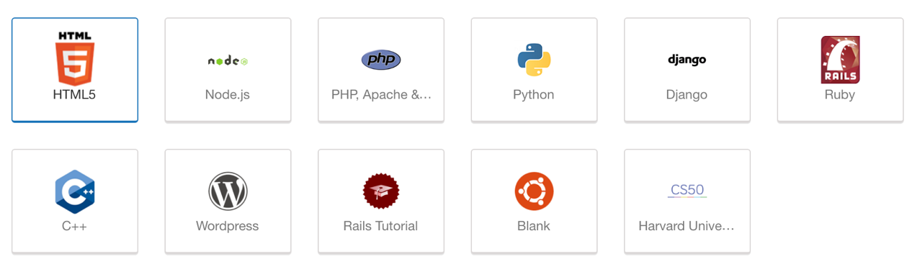
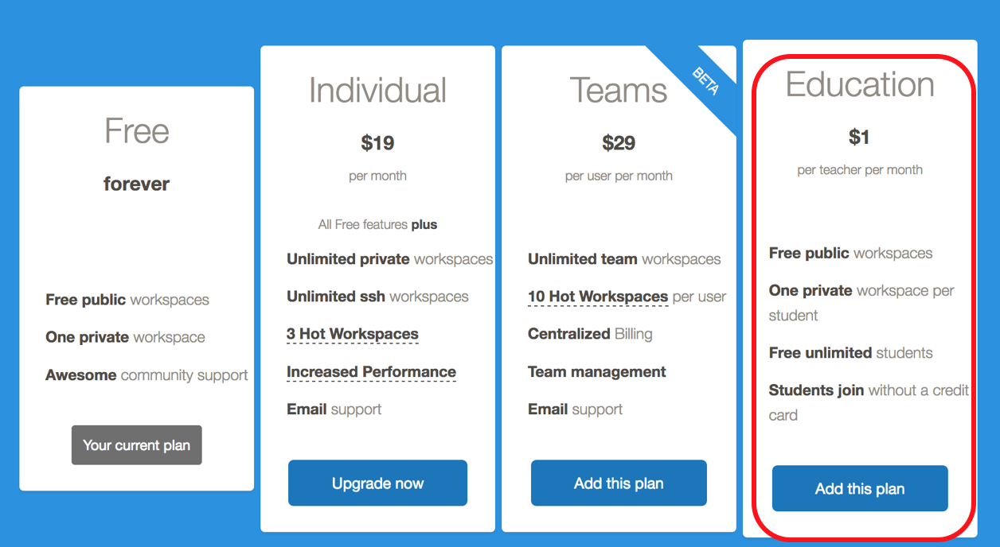
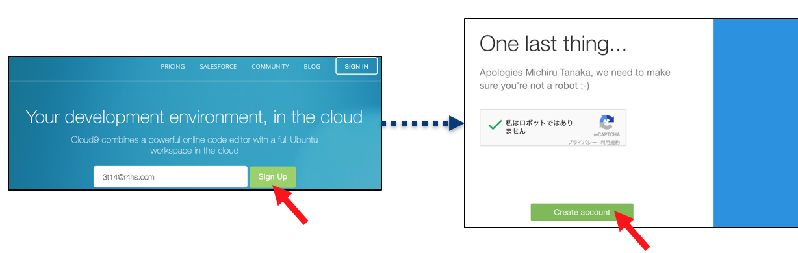
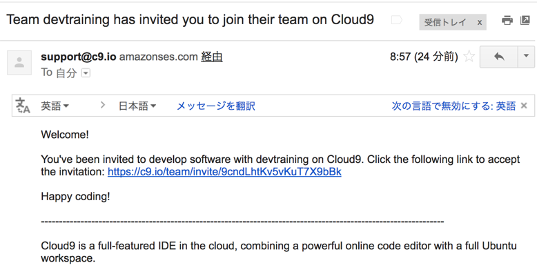
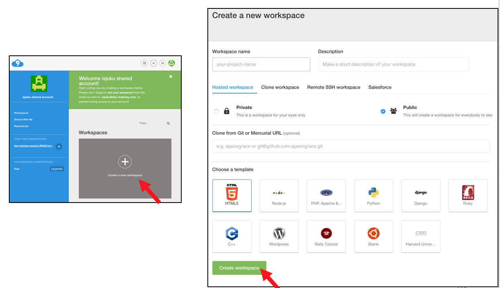
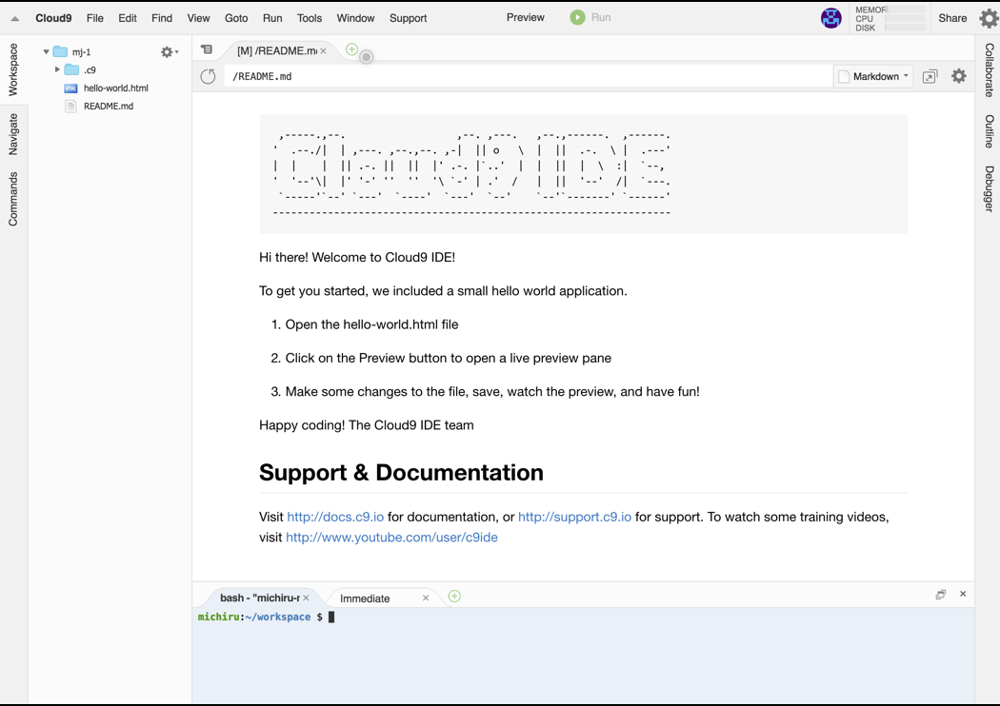
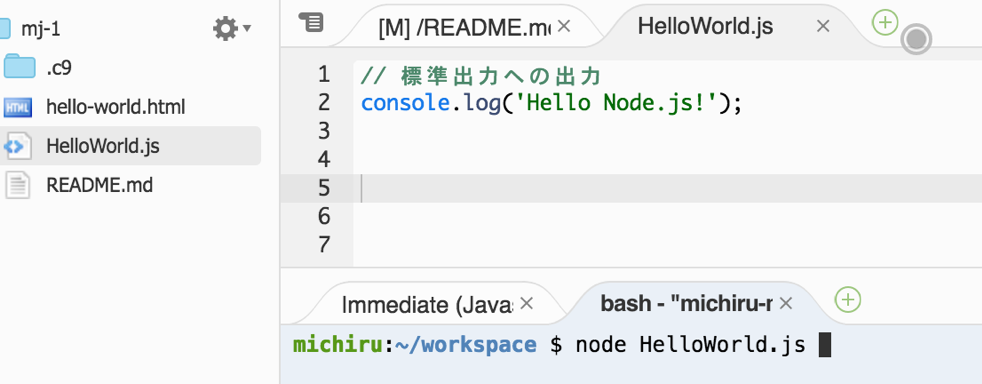
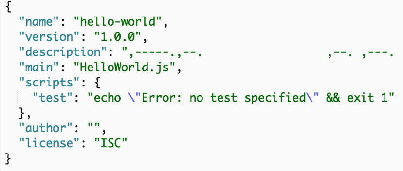
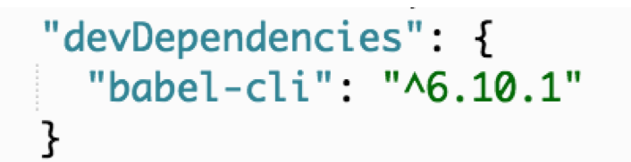
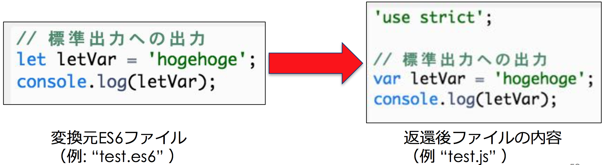

#### モダンJavaScriptプログラミング入門
# 3. JavaScript / ES6の開発環境
#### 田中　充
##### 株式会社イワテシガ

Web教材: http://mj.is-good.net


---
## 従来の開発環境の問題点
- JavaScript＝JavaScriptエンジン上でコンパイルせずに動作するもの
- ブラウザ（≒フロントエンド)上で実行するのみ
 - HTML内もしくはJavaScriptファイルに記述するだけ
- モジュールの構成管理に対応していなかった。
 - モジュール間の依存関係が不明
 - メンテナンスしづらい問題が発生

---

## CommonJSの登場
- ブラウザ以外のJavaScriptの仕様を策定するためのプロジェクト
- 当初はサーバーのみを対象として検討していたためServerJSと命名されたが、その後、より広くを対象する方針にしたためCommonJSに改名
- 仕様の内容
 - Modules
 - Packages
 - Promises
 - Systemなど

---
### CommonJSにおけるモジュールの定義と利用例

```JavaScript
// math.js
module.exports.add = function() {
  var sum = 0, i = 0, args = arguments, l = args.length;
  while (i < l) {
    sum += args[i++];
  }
  return sum;
};

// increment.js: math.jsファイルのモジュールaddを取得
var = add = require('math').add;
// increment関数をモジュールとして出力
exports.increment = function(val) {
  return add(val, 1);
};

// to be continued
```
@[2](add関数を外部に公開)
@[11](math.jsファイルのadd関数を参照)
+++

### CommonJSにおけるモジュールの定義と利用例

```JavaScript

// main.js:
//  increment.jsで定義されたincrement関数をinc関数として採用
var inc = require('increment').increment;
var a = 1;
inc(a);

// end
```
@[4](increment.jsファイルのincrement関数を参照)

---
## Node.jsの登場

- Node.jsはUnixプラットフォーム上で動作するサーバーサイドのJavaScript実行環境
- 2009年にRyan Dahl氏によって開発
- JavaScriptエンジンはGoogle V8を利用
- Node.jsでは、CommonJSのモジュール機能等の一部仕様を採用
- 現在はWebSocketやIoTのスクリプト言語やその他の目的で広く利用
- パッケージ管理コマンドであるnpmは、JavaScriptのパッケージ管理ソフトとして広く普及

---
## JavaScriptのモダンな開発環境

- サーバーサイドJavaScript実行環境であるNode.jsを活用することが一般的
 - npmコマンドによるJavaScriptライブラリのパッケージ管理
 - npmコマンドが使えれば、altJSやSassやLESSなどのCSSプリプロセッサ、さらにはトランスパイラ環境も導入が容易！

---
## 当研修で利用する統合開発環境: Cloud9 https://c9.io

- クラウド統合開発環境<br /> <em>“Development As A Service”
(PaaS型の開発環境を提供）</em>
- ソースコードを公開してもよいのであれば、無料で無制限のワークスペースの利用が可能
- Sublime風のタブテキスト編集環境の利用が可能
- 言語に応じたコード補完機能を提供

---
## 利用可能なワークスペースのテンプレート


---
## Cloud9の料金体系
<div align="center">

<br />
https://c9.io/pricing
</div>


---
## cloud9の利用登録（通常）
1. https://c9.io にアクセス
1. メールアドレスを入力し、**[Sign Up]** をクリック
1. 名前、ユーザ名などの情報を入力して **[Create Account]** をクリック



---
## Cloud9の利用登録（当研修）
1. Webアンケートに入力したメールアドレスに、Cloud9の招待メールが送信される
1. 受信したメールのリンクをクリック
1. あとは、通常のユーザー登録とほぼ同様

<div align="center">

</div>

---
## ワークスペースの作成
- この研修ではテンプレートとしてHTML5を選択してください。
<div align="center">

</div>

---
## Cloud9の画面構成


---
## Node.jsの導入と利用
- HTML5テンプレートを利用する場合、ワークスペース作成時に **Node.js** はあらじめインストールされており即利用可能
- **Node.js** は、JavaScriptのファイルをコマンドラインから呼び出して実行可能

<div align="center">

</div>

---
## JavaScriptの実行方法

- **node** コマンドを利用してシェルからJavaScriptを実行
+ 例）
 1. ファイル*hello_world.js*を作成し保存する
```JavaScript
console.log('Hello World');
```
 1. **node** コマンドを用いて上記ファイルを実行する
```Bash
$ node hello_world.js
```

---
## npm
#### https://www.npmjs.com/
- Node Package Manager
- Node.jsアプリで利用するパッケージを管理するためのツール
- npmコマンドでアプリのインストール、共有、配布を行うことができる

---
## npmコマンドの利用方法
### 作業ディレクトリの初期化
```Bash
 $ npm init
```
- 上記コマンドを実行するとパッケージに関する情報として、パッケージ名、Version等について問い合わせあり
- 未定の場合は全て改行コードを入力してもよい
 - 後の修正は結果として生成される **package.json** ファイルを編集すればよい

---
## package.jsonとは
- 現在のディレクトリ階層以下にどのようなプログラムが入っているかを示すファイル
- 利用する **npm** パッケージがある場合は、この **package.json** にその情報を登録する

+++
## package.jsonの例


---
## Babelのインストール
#### https://babeljs.io/
- Babelは、異なるバージョンのJavaScriptのコードを変換できる **トランスパイラ（トランスコンパイラ）**
- トランスパイラ **Babel** は、**npm install** コマンドを用いてインストール
```
npm install --save-dev babel-cli
```
- ``---save-dev``オプションを加えることで *pacakge.json* に開発時に必要なパッケージとして追記（更新）される
<div align="center">

</div>
---
## BabelのES6, ES7の対応化
- Babelは様々なJavaScriptのトランスコンパイラ
- 個々の対象言語は``npm intall``コマンドを用いて **babel-cli** とは別にインストールする必要あり
- ES6, ES7用パッケージのインストール方法
 - ES6の場合
  ```
  $ npm install --save-dev babel-preset-es2015
  ```
 - ES7の場合
  ```
   $ npm install --save-dev babel-preset-es2016
  ```

---
## Babelの設定
- Babelにデフォルトのコンパイル言語として**ES6**を割り当てるため、*~/.babelrc* ファイルに下記を記述(ES6の場合)
```json
{ "presets": ["es2015"] }
```
---
## ES6のトランスパイル方法
- **babel** コマンドを用いてトランスパイル（変換）
```Bash
$ babel ES6のファイルパス > 変換後のファイルパス
```
- 例（*test.es6* をトランスパイルし、*test.js* に変換）
```Bash
$ babel test.es6 > test.js
```
<div align="center">

</div>

---
### Cloud9におけるNode.jsのアップグレード
- *Node.js* のバージョンの確認方法
```
$ node -v
```
- **バージョン8** へのアップグレード
```
$ nvm install 8
```
- バージョン8では、ES modulesなどを除き、ほとんどのES6, 7の機能を充足。トランスパイルする必要はない

- バージョンの切り替え方法
 - **バージョン4** の利用に切り替える
```
$ nvm use 4
```
