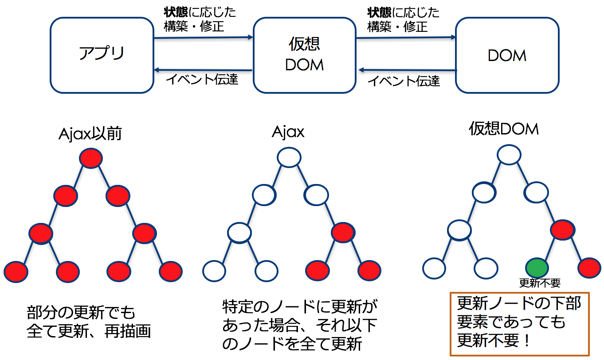

#### モダンJavaScriptプログラミング入門
# 7. React.jsの基本
#### 田中　充
##### 株式会社イワテシガ

Web教材: http://mj.is-good.net

---
### React.jsの背景

- JavaScriptコード記述の生産性問題
 - コードの混在とグローバル変数の衝突
 - 再利用性
 - 保守性、可読性の問題
- Viewのレンダリング効率の問題
 - DOM管理の複雑性と非効率性

---
### React.jsとは
- __UIを構築するため__ のFacebook製JavaScriptライブラリ
 - ターゲット：MVCのうちの **V(View)**
- 近年急速にポピュラーに
 - 対抗馬：Google AngluarJS, vue.js等
- **仮想的なDOM** の構造をJavaScriptに持ち、画面表示を更新する際は、差分のみを実際のDOMに対して適用することで、高速に処理することが可能
- コンポーネントベースの開発のため、JSでも再利用性が高いコードを記述することが可能

---
### Learn Once, Write Anywhere
- 「一度学べば、どこでも書ける」
- **Java Virtual Machine** の”**Write Once, Run Anywhere**”に対する言葉
- Webアプリだけではなく、スマートフォンアプリ、タブレットアプリなどでもReactの仕組みで開発することができる。
 - **React Native**

---
### GitHubに見るReact.jsの人気度

- Angular.js


- vue.js


- React.js


---
### 特徴1: 宣言的
- これまでのDOM操作は命令的
- 命令的
 - 命令の手続きを与えていくアプローチ
   - 連続的なコマンドの記述
- 宣言的
 - 実現したいことを記述していく形
 - 問題の性質や関係性を記述していくアプローチ

---
### 命令的 vs 宣言的の例
命令的
 1. 台所に行く
 1. 冷蔵庫を開ける
 1. 冷蔵庫からチキンを取る
 1. テーブルにチキンを置く

宣言的
 - 夕食としてチキンを食べたい。

 Reactでは、**宣言的** に状態に応じた出力内容をコードに記述していく（段階的詳細化）

---
### 特徴2: 仮想DOM
- 仮想DOM：DOM構造を必要な部分だけ取り出し抽象化したもの。
 - 状態の更新をノードごとに監視。必要な箇所だけを更新するアプローチ
- DOMツリーのうち、値や状態の更新のあるものだけを更新するアプローチ
 - これまでは、部分のいずれかに更新内容があれば全て上書きしていた。
  - 非効率

---
### 仮想DOM


---
### 特徴3:
再利用可能なコンポーネント
一度定義したら、他で流用可能なため再利用性が高い

```JSX
class ShoppingList extends React.Component {
  render() {
    return (
      <div className="shopping-list">
        <h1>Shopping List for {this.props.name}</h1>
        <ul>
          <li>Instagram</li>
          <li>WhatsApp</li>
          <li>Oculus</li>
        </ul>
      </div>
    );
  }
}
```

---
### SPAとは
SPA = Single Page Application
従来のサーバーサイドのWebアプリ
Webページが複数存在
ページごとに通信を行って、画面全体を再取得
TCP/IPのコネクション接続のためのロス
画面全体を再生成するための無駄な処理時間

SPAとは
SPAは、Webアプリ全体をダウンロードしてから利用
ページ切り替え時に無駄な通信が不要
サーバー上のリソースへのアクセス時
Ajaxなどバックグラウンドで非同期通信を行いながら処理
その結果→ サクサクとした動作！

## React.jsの基本
参考ページ
https://facebook.github.io/react/docs/hello-world.html

---
### Hello, World!
#### HTMLファイル単体版
HTMLファイルをダウンロード https://facebook.github.io/react/downloads/single-file-example.html
scriptタグの内部上にJSXのコードを記述していけばよいだけ。
ただし、このタイプのReact.jsの利用方法は、本番用ではなく、あくまでもお試し用

---
### ソースコードの中身

---
### Hello, World
#### create-react-app利用版
src/index.jsを下記のように修正し保存
public/index.html内に<div id=“root”></div>が定義されている前提

---
### ReactDOM.renderメソッドの役割

---
### create-react-appのビルド
 npm startのみでは開発環境のみでの動作
開発したものをビルドしてHTML, CSS, JS各ファイルの静的なファイル群として提供できれば、任意のWebサーバー上で公開可能
ビルドコマンド
$ npm run build

---
### ビルド結果
buildフォルダが生成される

---
## JSXの導入

---
### JSXとは


JSXは、文字列でもHTMLでもないJavaScript拡張のタグ文法
ReactでUIがどのように見えるべきかを記述する際に利用


---
### JSXの埋め込み表現
JSX内において、中括弧{}で囲むことで、JavaScriptを埋め込むことができる。

---
### JSXは式の一種
JSXは、式の一種であるためif文やforループの内部にJSXを利用可能
変数への代入、引数への割り当て、関数からの戻り値としても利用可能

---
### 属性の指定
文字列リテラル


中括弧を用いたJS埋め込み

---
### 子要素の指定
空要素の場合
XMLと同様に空要素タグ(<タグ名 />)の利用も可


通常の子要素の表現
HTMLと同様の表現

---
### 属性命名規則
HTMLの属性名とは異なりJSとして扱われるのでcamelCase
必ずしもHTMLと属性名が一致しない
実行時に文法チェック。コンソール上で警告を確認可能


例

---
### JSXはインジェクション攻撃対策に対応
JavaScriptのセキュリティ対策
→XSS（クロスサイトスクリプティング）攻撃対策
そのまま変数展開→<script>タグが挿入されると実行され、不正な攻撃の恐れ
ReactDOMはデフォルトの場合、描画前にJSXに埋め込まれた値はエスケープ化
何もせずに攻撃回避可能

---
### JSXの変換ツール
変換ツールの例
 JSX → JavaScript
 https://babeljs.io/repl/

 HTML → JSX
 http://magic.reactjs.net/htmltojsx.htm

---
### JSXは内部的にオブジェクトを表す
JavaScriptに変換した場合の例
