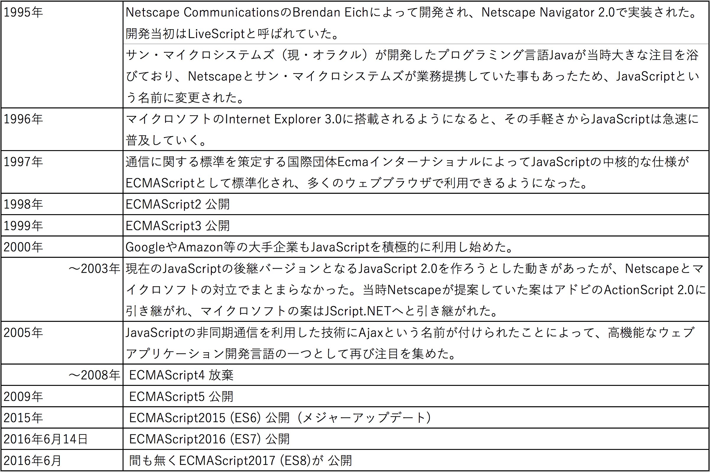

### モダンJavaScriptプログラミング入門

#### 田中　充
##### 株式会社イワテシガ

Web教材: http://mj.is-good.net

---
### 研修内容

- 当研修の概要
- JavaScriptの歴史
- JavaScript / ES6の開発環境
- JavaScriptの基本文法
- ES6の基本文法
- React.jsの紹介

---
## 当研修の概要

---
### 研修の背景
- 従来のJavaScript
 - Webページの動的処理を行うスクリプト言語として広く普及
 - 大規模なWebアプリ構築には向かず非効率的
 - ブラウザ間の仕様の違いの問題
- モダンなJavaScript
 - 効率的な文法
 - WebだけでなくIoT、スマートフォンアプリ開発の主要な言語の一つ
 - フレームワークを利用することで、大規模なアプリの開発に活用可

---

### 目標
- モダンなJavaScriptとしてES6を取り上げ、その開発環境の構築例と基本文法について学ぶ
- モダンなJavaScriptフレームワークとしてReact.jsの基本について理解する

---

### 教材サイト
- http://mj.is-good.net
- 演習やその他のリンク集や参考となる資料をアップ
- 解説や演習の際に利用しますので毎回最初にページを開いてください。

---
### cloud9登録用Webメールアドレスの入力のお願い
- 当研修で利用する統合開発環境Cloud9を利用するには、通常はクレジットカード情報を入力する必要性あり。
- 一方、教育用のチームについては、クレジットカードの情報を入力せずにユーザー登録することが可能です。
- 教材ページから、指定するWebフォームを用いて、cloud9に登録するためのWebメールアドレスを入力してください。

---
### 予定

| 日付 | 内容 |
| :---: | --- |
| 10/4 (水)| JavaScript/ES6の開発環境 JavaScriptの基本文法 ES6の基本文法|
| 10/5 (木)| ES6の基本文法（関数とオブジェクト指向） React.js入門|

---
### 当研修の進め方
- Web上に教材ファイル及び関連リンク集をアップ
- スライド資料：当資料
- 演習問題集：復習・確認用問題集
- 解説→演習繰り返しを実施します。
- 休憩
 - 午前に1回、午後に2-3回10分程度の休憩時間を入れます。

---

## JavaScriptの歴史

---
### Webの進化
- 2012年あたりまでのWebの進化を分かりやすく図示したWebサイト
- http://www.evolutionoftheweb.com/

---
## Q. JavaScriptが誕生して今年で何年？

---

## A. 22年
- 開発コード：Mocha
- 1995年 5月23日にBrendan Eichが開発し、Netscape Navigatorに搭載してリリース
開発期間10日間？
- JavaScriptはNetscape Navigator2.0からの名称。

---
## Q. JavaScriptはJavaとは関係ない?

---

## A. △
- 言語文法的には大きく異なり、別もの。
- しかし、双方の登録商標は、当時Sun Microsystems. 現在はOracleが保持。
- JavaScriptは、1995/12/4にNetscapeとSunが共同で発表。

---
## Q. 当初JavaScriptの利用目的はクライアントサイド（ブラウザ）用のスクリプト言語だった？

---
## A. ×
- プレスリリースには、明確に”both the client and the server”と記載されており、当初はサーバーサイドも意識していた。
- ECMAScriptとJavaScriptの関係
- ECMA
 - 情報通信システムの分野における国際標準化団体の旧名称。European Computer Manufacturer Association（欧州電子計算機工業会）
 - 現在はEcmaインターナショナルと呼ばれる。

+++

- ECMAScriptとは
 - Ecmaインターナショナルが定めるJavaScript言語仕様の国際標準規格ECMA-262のこと
 - 最新版：ECMAScript2017(ES8)

---
#### JavaScriptの誕生からES7の誕生までの流れ

---
## ES6の正式後悔は約2年前
### JavaScript言語仕様の大変革
---

## ES6 = ECMAScript2015
- ECMAScriptとは、国際的な標準化団体であるEcmaインターナショナルによって、JavaScriptを元に標準化された言語仕様。JavaScriptのブラウザ間での互換性を高めるために策定された。
- 2015年6月17日に公開された二つ前のバージョン。

---
## 当研修における旧式JavaScriptの定義

- ECMAScript5までの文法とさせて頂きます。
 - altJSは対象外

---

## 旧式JavaScriptの問題点
 - モジュール/パッケージ管理（モジュール定義ができない、パッケージの構成管理ができない）
 - 関数/変数のグローバル感染による問題
 - わかりにくいプロトタイプ型オブジェクト指向表現
   - 広く普及したクラス型オブジェクト指向言語の表記と異なる
 - モダンシンタックス表現に対応していない
   - アロー関数が利用できない
   - 分割代入（タプル）
   - 他

  

---

## altJS（オルトジェイエス）

- TypeScript
 - マイクロソフトのJavaScriptに静的型付けを導入した言語
- CoffeeScript
- Haxe（ヘックス）
- Dart (Google)
- JSX (DeNA)

---
## ES6とは
### かつてない規模のメジャーアップデートをしたJavaScript
- モジュール管理機能
-  クラス型オブジェクト指向言語の記述が可能に
- アロー関数記述が可能に
- Etc…

---
# JavaScript開発スタイルの遷移

---
# ブラウザのECMAScript対応状況
- ECMAScript 6 compatibility tableを見ることで確認可能
https://kangax.github.io/compat-table/es6/
