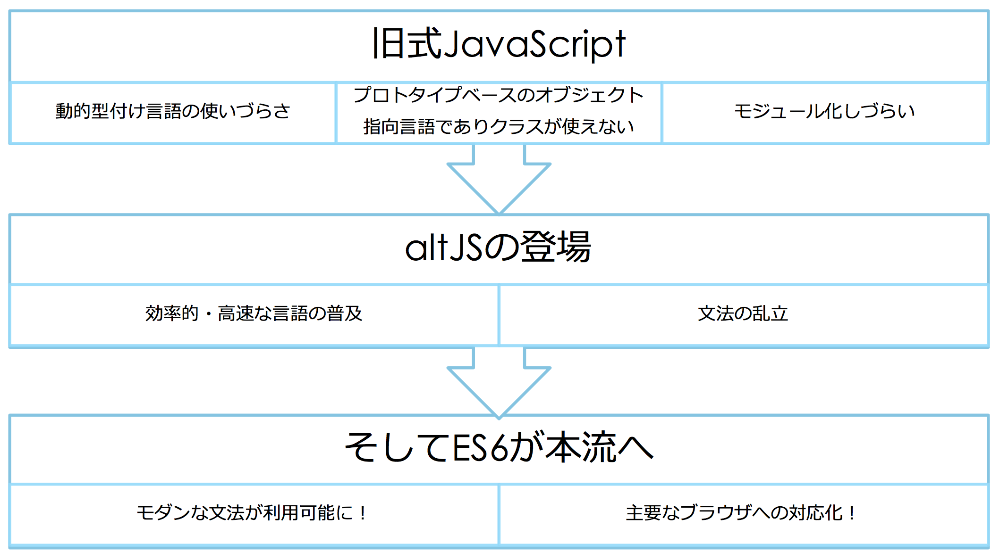

#### モダンJavaScriptプログラミング入門
# 2. JavaScriptの歴史
#### 田中　充
##### 株式会社イワテシガ

Web教材: http://mj.is-good.net

---
### Webの進化
- 2012年あたりまでのWebの進化を分かりやすく図示したWebサイト
- http://www.evolutionoftheweb.com/

---
## Q. JavaScriptが誕生して今年で何年？

---

## A. 22年
- 開発コード：Mocha
- 1995年 5月23日にBrendan Eichが開発し、Netscape Navigatorに搭載してリリース
開発期間10日間？
- JavaScriptはNetscape Navigator2.0からの名称。

---
## Q. JavaScriptはJavaとは関係ない?

---

## A. △
- 言語文法的には大きく異なり、別もの。
- しかし、双方の登録商標は、当時Sun Microsystems. 現在はOracleが保持。
- JavaScriptは、1995/12/4にNetscapeとSunが共同で発表。

---
## Q. 当初JavaScriptの利用目的はクライアントサイド（ブラウザ）用のスクリプト言語だった？

---
## A. ×
- プレスリリースには、明確に”both the client and the server”と記載されており、当初はサーバーサイドも意識していた。
- ECMAScriptとJavaScriptの関係
- ECMA
 - 情報通信システムの分野における国際標準化団体の旧名称。European Computer Manufacturer Association（欧州電子計算機工業会）
 - 現在はEcmaインターナショナルと呼ばれる。

+++

- ECMAScriptとは
 - Ecmaインターナショナルが定めるJavaScript言語仕様の国際標準規格ECMA-262のこと
 - 最新版：ECMAScript2017(ES8)

---
#### JavaScriptの誕生からES7の誕生までの流れ

---
## ES6の正式後悔は約2年前
### JavaScript言語仕様の大変革
---

## ES6 = ECMAScript2015
- ECMAScriptとは、国際的な標準化団体であるEcmaインターナショナルによって、JavaScriptを元に標準化された言語仕様。JavaScriptのブラウザ間での互換性を高めるために策定された。
- 2015年6月17日に公開された二つ前のバージョン。

---
## 当研修における旧式JavaScriptの定義

- ECMAScript5までの文法とさせて頂きます。
 - altJSは対象外

---

### 旧式JavaScriptの問題点
 - モジュール/パッケージ管理（モジュール定義ができない、パッケージの構成管理ができない）
 - 関数/変数のグローバル感染による問題
 - わかりにくいプロトタイプ型オブジェクト指向表現
   - 広く普及したクラス型オブジェクト指向言語の表記と異なる
 - モダンシンタックス表現に対応していない
   - アロー関数が利用できない
   - 分割代入（タプル）

---

## altJS（オルトジェイエス）

- TypeScript
 - マイクロソフトのJavaScriptに静的型付けを導入した言語
- CoffeeScript
- Haxe（ヘックス）
- Dart (Google)
- JSX (DeNA)

---
## ES6とは
### かつてない規模のメジャーアップデートをしたJavaScript
- モジュール管理機能
-  クラス型オブジェクト指向言語の記述が可能に
- アロー関数記述が可能に
- Etc…

---
## JavaScript開発スタイルの遷移

---
## ブラウザのECMAScript対応状況
- ECMAScript 6 compatibility tableを見ることで確認可能
https://kangax.github.io/compat-table/es6/

---
## 主要なブラウザの対応状況
- デスクトップ用ブラウザ：ES5, ES6にほぼ対応
- モバイル用ブラウザ：ES6にもほぼ対応。
- IE11: わずか10%程度の対応

---
## ES6の対応の仕方

- 現在: モバイルファースト
 - トランスコンパイラ（トランスパイラ）を用いることで過去バージョンのJavaScriptへのコンパイルを行うことで対応することが多かった。
- 最新のモバイルOSは、ES6にほぼ対応済みのため、必ずしもトランスパイルする必要はない
 - Android系のWebブラウザは必ずしも、最新とは限らないので、依然トランスパイラのニーズは高い。
